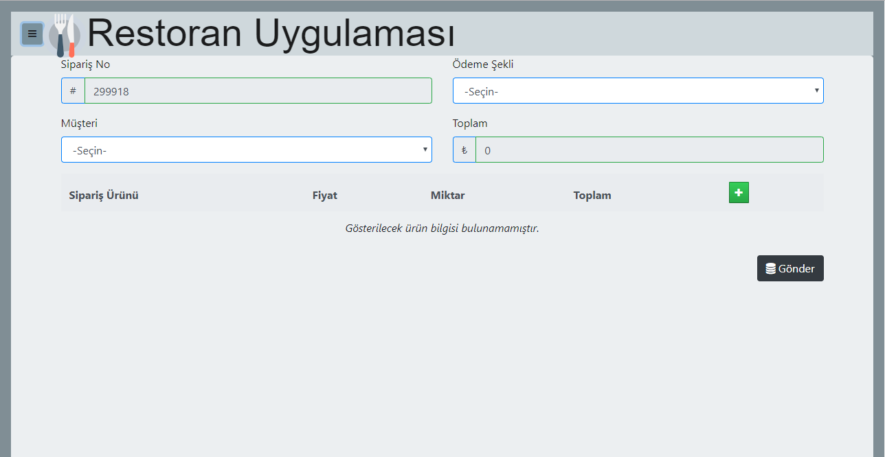

**1. Ana ekran görüntüsü

#Angular 8.1.1 
=>Bir restoran yönetim uygulamasıdır. 
=>Sipariş seçimi işlemlerine dayanır. 
=>Seçilen yiyeceğin adedine göre fiyatlandırması yapılır. 
=>Her müşteri kendi siparişini hazırlar. 
=>Siparişler listelenir. 
=>Sipariş detayları görüntülenir. 
=>Siparişler üzerinde ekle sil düzenle işlemleri yapılabilir. 
=>Ödeme bilgilerinin ekle/sil/düzenle gerçekleştiririlir. 
=>Ödeme bilgilerinin listelemesi gerçekleştiririlir. 
